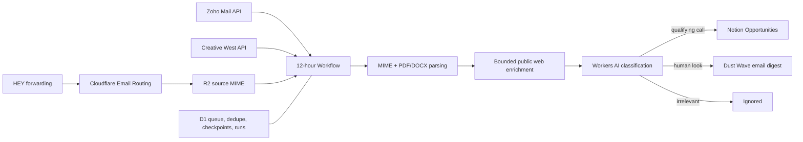

# Dust Wave Opportunity Radar

Dust Wave Opportunity Radar is a Cloudflare-hosted source triage service for creative-industry opportunities. It receives broad HEY forwarding, pulls selected Zoho folders, fetches a filtered Creative West opportunity feed, parses linked pages and PDF/DOCX attachments, classifies each item with Workers AI, and runs a 12-hour publishing batch.

Qualifying apply-or-submit calls are created or updated in the Notion Opportunities data source. Useful items that need a person’s judgment are grouped into one styled email digest. Irrelevant mail is recorded as ignored. The service does not run on a personal machine.

## Production behavior

- Schedule: 07:00 and 19:00 in `America/Denver`; an hourly cron selects those local slots across daylight-saving changes.
- HEY: official forwarding of non-spam mail to Cloudflare Email Routing. `Sealjay/mcp-hey` is limited to the optional historical backfill.
- Zoho: `Inbox`, `Dust Wave`, `Newsletter`, and `Notification`, with a seven-day initial window and one-hour checkpoint overlap.
- Creative West: open New Mexico opportunities for artists or organizations whose deadlines fall between the Mountain-time run date and 31 days later, sorted by newest open date.
- Notion: automatic create/update at batch time, including conservative equivalent-title matching and cleanup of automation-owned duplicate pages.
- Digest: sent to `alonso@hey.com` only when at least one item is waiting.
- Retention: raw and parsed R2 objects are purged after 24 hours; D1 retains operational metadata and structured classification results.

## System map



See [Architecture](docs/ARCHITECTURE.md) for component and sequence details and [Classification policy](docs/CLASSIFICATION.md) for the exact decision rules.

## Start here

```bash
npm ci
npm run check
npm run migrate:local
npm run dev
```

`npm run check` validates documentation links, checks generated Cloudflare types, type-checks TypeScript, runs the automated suite with enforced coverage floors, and builds a dry-run Worker bundle. `npm run test:coverage` runs the test/coverage portion alone and writes `coverage/coverage-summary.json`.

For a fresh Codex task, open this repository as the project folder and start with [Codex handoff](docs/CODEX-HANDOFF.md) and [AGENTS.md](AGENTS.md).

## Documentation

- [Documentation index](docs/README.md)
- [Setup](docs/SETUP.md)
- [Operations](docs/OPERATIONS.md)
- [Troubleshooting](docs/TROUBLESHOOTING.md)
- [Configuration reference](docs/CONFIGURATION.md)
- [Admin API](docs/API.md)
- [Testing](docs/TESTING.md)
- [Security model](docs/SECURITY.md)
- [Contributing](CONTRIBUTING.md)

## Repository layout

| Path | Responsibility |
|---|---|
| `src/ingest` | HEY ingestion, Zoho/Creative West synchronization, and safe web enrichment |
| `src/email` | MIME/PDF/DOCX parsing and digest rendering/sending |
| `src/ai` | Workers AI prompts, structured parsing, recovery, and deterministic policy |
| `src/notion` | Schema checks, entity resolution, safe create/update, duplicate cleanup |
| `src/storage` | D1 queue, state, checkpoint, digest, opportunity, and run persistence |
| `src/workflow` | Durable batch orchestration and retention cleanup |
| `migrations` | Ordered D1 schema migrations |
| `test` | Unit, adapter, route, state-machine, and orchestration tests |
| `scripts` | HEY import and documentation validation tools |
| `.github/workflows` | CI and manually dispatched production operations |

## External references

- HEY: official [forwarding](https://help.hey.com/article/1055-forwarding) for ongoing ingestion; [`Sealjay/mcp-hey`](https://github.com/Sealjay/mcp-hey) for historical import only.
- Zoho: official [Mail API](https://www.zoho.com/mail/help/api/) and [original message endpoint](https://www.zoho.com/mail/help/api/get-original-message.html).
- Creative West: public [Art Opps search](https://opportunities.wearecreativewest.org/search).
- Digest visual reference: [`aindaco1/rss-feed-digest`](https://github.com/aindaco1/rss-feed-digest), credited in [Notices](NOTICE.md).

Public source repository. Never commit email content, session cookies, OAuth credentials, API tokens, or `.dev.vars`.
