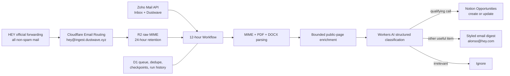

# Dustwave Opportunity Radar

Cloudflare-hosted email triage for creative opportunities. It receives broad HEY forwarding, pulls Zoho Inbox and `Dustwave`, extracts PDF/DOCX attachments, classifies the result with Workers AI, and batches eligible calls into Notion while emailing a digest of useful non-call items.

The production schedule is 7:00 AM and 7:00 PM `America/Denver`. Incoming mail is queued immediately; classification, Notion publishing, and digest delivery all wait for the next batch.

## Architecture



## Classification policy

- Notion: open calls where a person or team applies/submits for funding, selection, exhibition, screening, publication, a residency, fellowship, award, lab, pitch, or similar concrete opportunity.
- Digest: related jobs/commissions, workshops, events, games/interactive items, industry news, and uncertain calls. Empty digests are suppressed.
- Ignore: irrelevant material, closed notices without continuing value, routine receipts, and obvious promotions.
- Geography: reject only when New Mexico, Illinois, and Pennsylvania are all explicitly excluded. Eligibility in any one of the three is sufficient.
- Confidence: a supposed Notion item below `0.82`, or one without an official URL, is demoted to `Possible Opportunities` in the digest.
- Deduplication: URL plus a stable automation key. Recurring opportunities update one rolling Notion page and retain a short automation history.

Email and page text are treated as untrusted evidence, never as instructions. The AI receives a strict JSON schema and has no direct tools or credentials.

## Current activation state

The application can be deployed with the safe source flags in [`wrangler.jsonc`](wrangler.jsonc):

- `NOTION_ENABLED=false` — qualifying items remain `pending_notion`; none are lost.
- `ZOHO_ENABLED=false` — HEY ingestion and processing can operate independently.
- HEY forwarding must be enabled once in the HEY account after Cloudflare provisions the inbound address.

See [Setup](docs/SETUP.md) for the remaining account steps and [Operations](docs/OPERATIONS.md) for monitoring and recovery.

## Development

```bash
npm ci
npm run check
npm run migrate:local
npm run dev
```

`npm run check` regenerates/checks Cloudflare types, type-checks TypeScript, runs the test suite, and builds a deployment bundle without uploading it.

## Repository layout

- `src/ingest` — Email Worker, Zoho API sync, safe web enrichment
- `src/email` — MIME/PDF/DOCX parsing and digest rendering
- `src/ai` — structured classification and policy enforcement
- `src/notion` — idempotent create/update adapter
- `src/workflow` — durable batch orchestration
- `migrations` — D1 schema and configuration seed
- `scripts/hey-backfill.mjs` — one-time, cloud-run seven-day HEY import through `Sealjay/mcp-hey`
- `.github/workflows` — CI, manual deployment, and HEY backfill

## Upstream references

- HEY: official [forwarding](https://help.hey.com/article/1055-forwarding) for ongoing ingestion; [Sealjay/mcp-hey](https://github.com/Sealjay/mcp-hey) only for the one-time backfill.
- Zoho: official [Mail API](https://www.zoho.com/mail/help/api/) and MIME [original message endpoint](https://www.zoho.com/mail/help/api/get-original-message.html).
- Cloudflare: Workers, Workflows, D1, R2, Workers AI, Email Routing, and Email Sending.
- Digest visual reference: [`aindaco1/rss-feed-digest`](https://github.com/aindaco1/rss-feed-digest); attribution is recorded in [`NOTICE.md`](NOTICE.md).

Private project. No email contents or credentials belong in Git.
