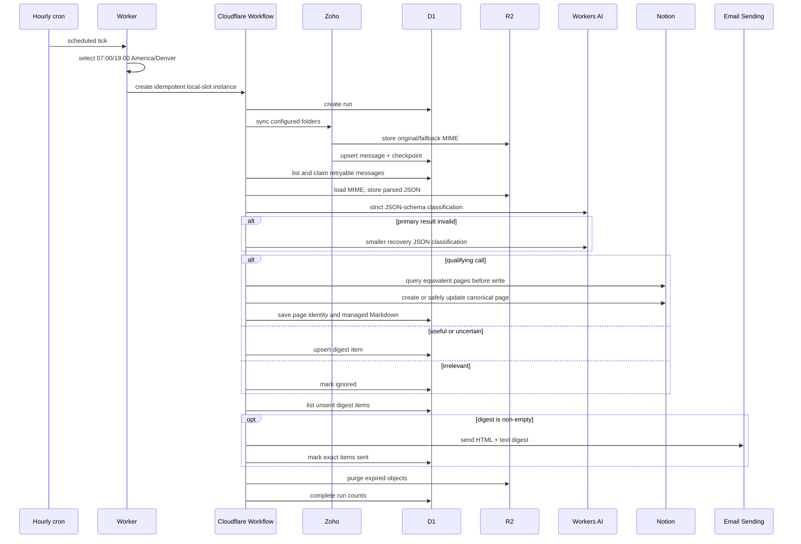

# Architecture

## Context

Dust Wave Opportunity Radar converts two private mail sources into one controlled creative-opportunity workflow. Cloudflare hosts every persistent and scheduled component. GitHub provides CI and explicitly dispatched operational workflows; it is not in the steady-state message path.

## Components

| Component | Responsibility | Persistent content |
|---|---|---|
| Worker HTTP/email/scheduled handlers | Receive forwarded HEY MIME, expose admin routes, and translate hourly ticks into local batch slots | None |
| Cloudflare Workflow | Orchestrate retries and named durable steps for each 12-hour batch | Workflow execution metadata |
| D1 | Queue state, source dedupe, classifications, Notion identity mapping, digest state, checkpoints, and run history | Structured metadata; no attachment binaries |
| R2 | Raw RFC 822 MIME and parsed JSON needed for processing/retry | Message and attachment-derived content for 24 hours |
| Workers AI | Produce a strict opportunity classification, then a smaller recovery result if needed | Provider-governed inference telemetry |
| Zoho Mail API | Read the configured folders and original MIME | Source system owns mail |
| Notion API | Inspect schema and create/update Opportunities pages | Published opportunity records |
| Email Sending | Deliver one non-empty human-review digest | Delivery metadata |
| GitHub Actions | CI, manual deployment, integration checks, source-only sync, recovery, and HEY historical import | Action logs and configured secrets |

## Batch sequence

## Idempotency and recovery

- A source message is unique on `(source, external_id)`. Re-import updates metadata without resetting a successful terminal state.
- Workflow instance IDs use the local date/hour slot, so duplicate cron delivery does not create duplicate scheduled batches.
- A D1 run ID is inserted with `INSERT OR IGNORE`; non-forced duplicate runs return a no-op summary.
- A message claim increments `attempts`. Failed work and processing claims stale for 15 minutes are eligible until four attempts.
- Zoho checkpoints overlap by one hour to tolerate ordering and boundary delays; the source/external unique key removes repeats.
- Notion is queried before every create. URL variants, exact/fuzzy title evidence, title years, automation keys, and D1 ownership are used conservatively.
- Digest items are keyed by message ID and marked sent only after the email binding succeeds.

## Failure isolation

Each message is processed independently inside the batch. Parsing/classification failures become a failed message or a human-review recovery item; they do not prevent other messages from completing. Notion failures become `pending_notion` so the structured result can retry without reparsing expired raw MIME. A failure outside per-message work marks the run failed and lets the Workflow retry according to its step policy.

## Code map

- Entrypoints and admin routing: `src/index.ts`
- Durable orchestration: `src/workflow/batch.ts`
- Ingestion: `src/ingest/email-worker.ts`, `src/ingest/zoho.ts`
- Parsing and web evidence: `src/email/parse.ts`, `src/ingest/web-enrichment.ts`
- AI and deterministic policy: `src/ai/classify.ts`
- Notion reconciliation: `src/notion/client.ts`
- State persistence: `src/storage/database.ts`
- Digest: `src/email/digest.ts`

See [Data model](DATA-MODEL.md), [Notion integration](NOTION.md), and [Security](SECURITY.md) for deeper boundary details.
