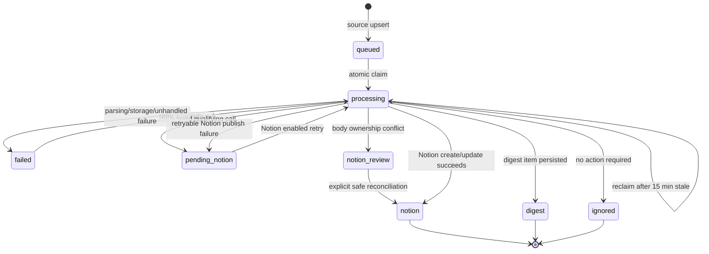

# Data model

D1 is the operational source of truth. Migrations are ordered and append-only in `migrations/`; the current local schema version is `7`. Remote application of migration 0007 remains a separately authorized operation.

## Tables

### `messages`

One row per source item, unique on `(source, external_id)`. Sources are `hey`, `zoho`, `creative_west`, `colossal`, and `hyperallergic`. It stores source/mailbox metadata, R2 keys, classification JSON, canonical URL, retry state, and bounded error detail. Creative West external IDs combine the upstream source/ID with a content digest, so unchanged snapshots deduplicate while substantive listing updates are reprocessed. `raw_r2_key` becomes an empty string after retention cleanup; `parsed_r2_key` becomes `NULL`.

`discovery_context_json` stores validated discovery URL, organizer/application URLs, ambiguous shared URLs, and a grouped-program review flag for public roundup candidates. It is separate from untrusted MIME and loaded into the shared policy.

### `source_documents`, `source_document_messages`, and `source_http_cache`

These shared tables persist Colossal and Hyperallergic article month/URL/publication metadata, HTTP validators, a content hash, next-entry cursor, pending/retry state, checked time, and links to message snapshots. State is scoped by source. They hold no article/feed bodies. Pending documents and documents linked to expired queued/failed snapshots remain eligible beyond the normal month window. Feed validators advance only after discovered work is durable. See [Colossal](COLOSSAL.md) and [Hyperallergic](HYPERALLERGIC.md).

### `opportunities`

Maps a stable automation key to a Notion page, latest source item, canonical URL, title/organization, observation/publish timestamps, the last `managed_markdown`, and `body_management`. The managed Markdown is not a visible marker; it is the exact prior generated body text used to replace only automation-owned content safely. `body_management='manual'` means automation may update properties but never the page body.

`notion_page_id` is unique in practice during upsert. When a new automation key resolves to the same Notion page, the old mapping is deleted in the same D1 batch.

### `digest_items`

One rolling row per message. It stores category, title, summary, public URL, deadline, sender label, receive time, sent time, and run ID. `sent_at IS NULL` is the delivery queue.

### `runs`

One row per Workflow instance ID with scheduled/start/completion time, status, seven outcome counts, and bounded failure detail. `pending_notion_count` records retryable Notion failures; `notion_review_count` records permanent body-safety conflicts requiring an explicit operator decision. Duplicate IDs are ignored.

### `source_checkpoints`

One receive-time cursor per `(source, mailbox)`. Zoho subtracts one hour from the cursor when reading to create a safe overlap. Creative West uses deterministic snapshot IDs rather than a cursor.

### `app_config`

Schema/version and historical safe-default feature flags. Runtime feature flags are read from Worker variables; do not treat these rows as the live production switch without changing the application design.

## Message state machine

`attempts` increments on every claim. Queue selection includes `queued` and `failed` rows with retained raw MIME and fewer than four attempts, stale `processing` rows, and `pending_notion` only while Notion publishing is enabled. `notion_review` is not retried automatically; reconciliation either refreshes formatting-equivalent managed text or preserves the existing page body as manually owned.

## Content retention

| Content | Store | Retention |
|---|---|---|
| Raw RFC 822 MIME, synthetic listing MIME, and binary attachment content | R2 | 24 hours from ingestion by current production config |
| Parsed source JSON and extracted attachment text | R2 | Same cleanup path as raw MIME |
| Structured classification and rationale/evidence | D1 `messages` | Operational history; no automatic expiry currently |
| Digest metadata | D1 `digest_items` | Operational history; no automatic expiry currently |
| Notion identity and managed Markdown | D1 `opportunities` | Required for future reconciliation |
| Source cursors and run counts | D1 | Operational history |

The cleanup batch lists both expired R2 keys, deletes in groups of at most 500, then clears only their references. A failed row with an expired empty raw key is requeued with attempts reset if that source item is imported again. Public-source snapshot ingestion also restores expired queued payloads without resetting successful terminal messages.

## Migration procedure

1. Add the next `migrations/NNNN_description.sql` file.
2. Update the `schema_version` row in that migration.
3. Add the filename to `test/support/d1.ts` so tests apply production migrations in order.
4. Update this document and add a migration/state test.
5. Run `npm run migrate:local`, `npm run check`, and `npm run test:coverage`.
6. Run `npm run migrate:remote` only as an explicitly authorized production change, before deploying code that requires the schema.
